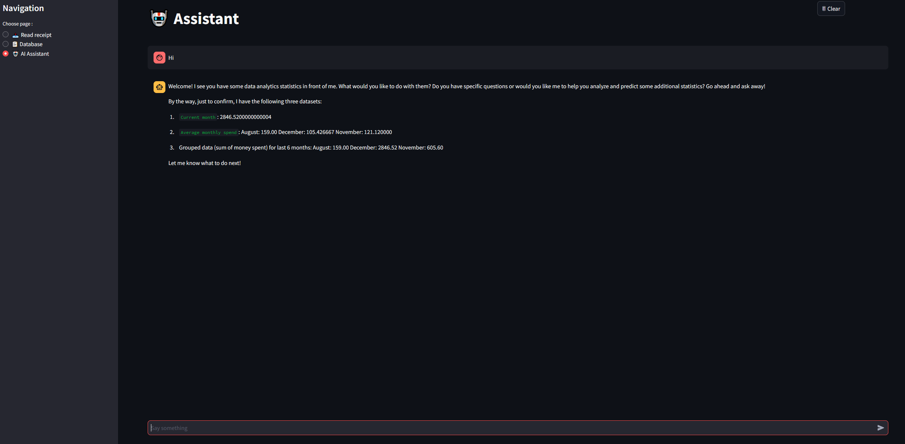

# Financial Management Project

## Overview
This project is a web-based application built using Streamlit to help users manage their finances efficiently. The application allows users to upload receipts, extract financial data using advanced AI models, manage a PostgreSQL database of financial records, generate insightful visualizations, and interact with an AI assistant to analyze their spending patterns.

## Features

### 1. Receipt Upload and Data Extraction
- **Upload Receipts**: Users can upload images of receipts in formats like JPG, PNG, or JPEG.
- **Data Extraction**: Leveraging the capabilities of the LLaMA 3.2-Vision model, the application extracts critical data from the receipts, including:
  - Total amount
  - Date
  - Company name
  - Business category (e.g., Food, Entertainment, etc.)
- **Manual Input**: For scenarios where AI extraction is not sufficient, users can manually input the receipt data.
- **Data Storage**: All extracted or manually entered data is stored securely in a PostgreSQL database.


### 2. Database Management and Visualization
- **Database Panel**: Displays all stored financial records in a tabular format, including fields such as ID, date, amount, company name, and category.
- **Data Analysis Tools**:
  - Specify a date range for analysis.
  - Group data by custom time intervals, such as day, month, or year.
  - Aggregate data using functions like sum or mean.
  - Generate dynamic visualizations (e.g., bar charts) based on the selected criteria.


### 3. AI Assistant
- **Chatbot Integration**: Powered by the LLaMA 3.2 model, the AI assistant provides users with:
  - Current month’s total expenditure.
  - Aggregated spending for the last six months, grouped by month.
  - Average monthly expenditure over the last six months.
- **User Interaction**: Users can ask the assistant specific questions about their spending patterns or request further analysis and predictions.



## Technology Stack
- **Frontend & Backend**: Streamlit
- **Database**: PostgreSQL
- **AI Models**: LLaMA 3.2-Vision for data extraction and LLaMA 3.2 for chatbot functionalities

## Getting Started

### Prerequisites
- Python 3.10 or later
- PostgreSQL 15 or later

### Installation
1. **Clone the Repository**:
   ```bash
   git clone https://github.com/yourusername/finance-management.git
   cd finance-management
   ```

2. **Setup Virtual Environment**:
   ``` bash
    python -m venv venv
    venv\Scripts\activate
   ```

3. **Instal Dependencies**:
   ```bash
   pip install -r requirements.txt
   ```


4. **Database Setup**:
- Create a PostgreSQL database
- Update the .env file with your database credentials.


5. **Run the Application**:
  ```bash
     streamlit run app.py
  ```